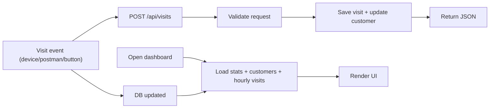

# Tree Nation Assessment

Small Laravel + Inertia + React demo where customer visits lead to tree planting.

Each visit event increments a customer visit counter, updates last connection time, and plants a tree every configurable number of visits.

## How To Run

### Prerequisites

- PHP 8.3+
- Composer
- Node.js 20+ and npm

### Setup

1. Install backend dependencies:

```bash
composer install
```

2. Install frontend dependencies:

```bash
npm install
```

3. Create environment file: 

```bash
cp .env.example .env  # make .env duplicate the example env first
php artisan key:generate
```

4. Create DB schema and seed demo data:

```bash
php artisan migrate:fresh --seed
```

5. Start the app:

```bash
npm run dev
```

### App URLs

- Home: `http://localhost:3000/`
- Dashboard: `http://localhost:3000/dashboard`
- API endpoint: `POST http://localhost:3000/api/visits`

---

## Connection Tree (How Everything Is Wired)

```text
Device / Postman / Frontend button
    -> POST /api/visits
        -> app/Http/Controllers/Api/VisitController.php
            -> app/Actions/RecordVisit.php
                -> customers table update
                -> visits table insert
                -> trees_planted increment every X visits

Browser Dashboard (/dashboard)
    -> app/Http/Controllers/DashboardController.php
        -> Inertia props
            -> resources/js/pages/Dashboard.tsx
                -> Stat cards
                -> Visits per hour table
                -> Customers table
                -> Simulate visits section
```

### Work flow



## Nice to Have ( not implemented in Assessment)

- **UI Components**: The current UI is built directly with Tailwind classes. We could adopt a component library like `shadcn/ui or chakra.ui or material ui components` to speed up UI consistency, reuse patterns, and reduce custom styling work.
- **Live Updates**: The dashboard currently refreshes using interval-based polling (only for Assessment). Realtime listeners (eg. WebSockets, Laravel Reverb, Laravel Echo) for realtime updates.
- **Rate Limiting**: API protection `POST /api/visits` limiting.
- **Queue Workers**: High traffic, queue visit processing.
---

## Data Model

### `customers`

- `external_id` (string, unique) - customer identifier from the device/API
- `name` (nullable string) - display name
- `visit_count` (int) - total visits for this customer
- `trees_planted` (int) - total trees planted for this customer
- `last_connected_at` (nullable timestamp) - latest visit time

### `visits`

- `customer_id` (FK -> customers.id)
- `visited_at` (timestamp)

Relationship: one customer has many visits.

---

## Rules

- Every successful visit event:
  - inserts one row in `visits`
  - increments `customers.visit_count`
  - updates `customers.last_connected_at`
- Trees planted rule:
  - 1 tree per `VISITS_PER_TREE` visits
  - controlled by `config/tree_demo.php` and `.env`
- Timezone:
  - demo is set to `Europe/Madrid` in `config/app.php`

---

## API Usage

### Endpoint

- `POST /api/visits`

### Headers

- `Content-Type: application/json`
- `Accept: application/json`

### Request body

```json
{
  "customer_id": "bob-from-postman",
  "name": "Bob from Postman"
}
```

Optional field:

- `visited_at` (date/datetime string)

### Response (201)

```json
{
  "message": "Visit recorded.",
  "data": {
    "customerId": "bob-from-postman",
    "displayName": "Bob from Postman",
    "visitCount": 1,
    "treesPlanted": 0,
    "lastSeen": "Jun 2, 2026, 12:40",
    "treePlanted": false
  }
}
```

### Validation error (422 example)

If `customer_id` is missing or invalid, Laravel returns a standard validation error JSON response.

### cURL example

```bash
curl -X POST "http://localhost:3000/api/visits" \
  -H "Content-Type: application/json" \
  -H "Accept: application/json" \
  -d '{"customer_id":"demo-customer","name":"Demo Customer"}'
```

---

## Frontend Sections

Dashboard contains:

- Total visits
- Current hour visits
- Total trees planted
- Visits-per-hour aggregation (grouped by date, with hourly rows)
- Customers table (visit count, trees, last seen)
- Simulate visits dropdown + Postman usage notes

---

## Assumptions

- SQLite
- No authentication/API
- Device integration is simulated via API calls (Postman/curl/frontend buttons).

---

## Tests

Backend (PHP unit test for api):

```bash
php artisan test
```

Frontend (Vitest for page generation):

```bash
npm test
```

- `tests/Feature/VisitApiTest.php`
- `resources/js/tests/Dashboard.test.tsx`

---

## Manual Test Commands

CLI helper command

```bash
php artisan testapi "demo-customer" --name="Demo Customer"
```

Useful checks:

```bash
php artisan route:list --path=api
```

